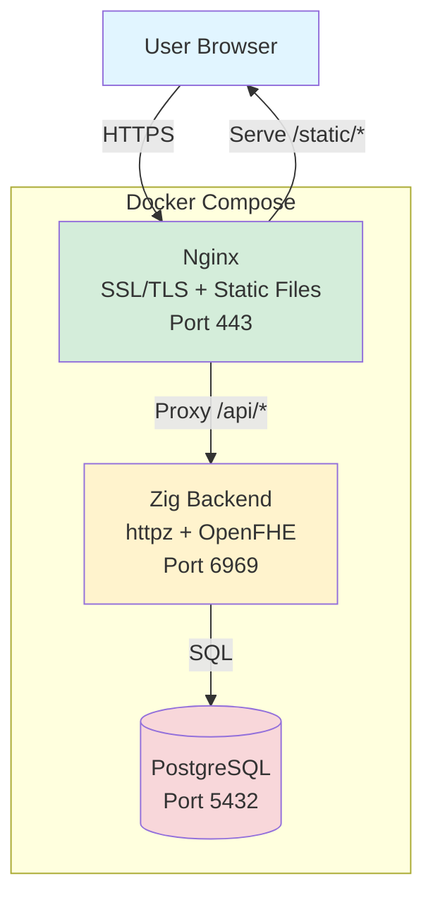
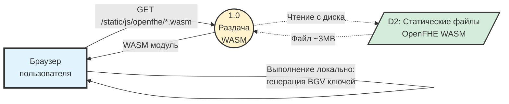
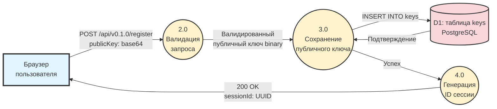
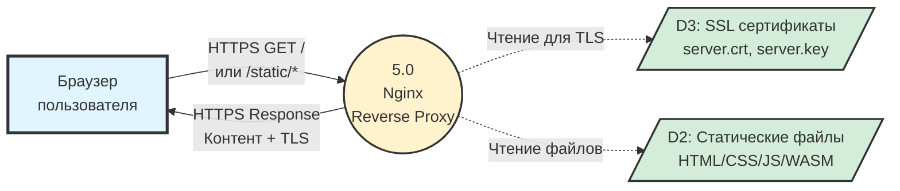
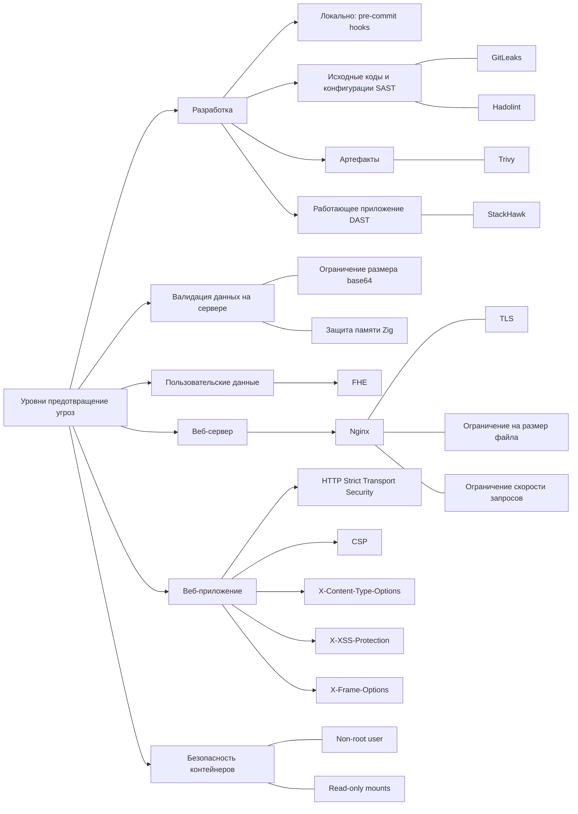
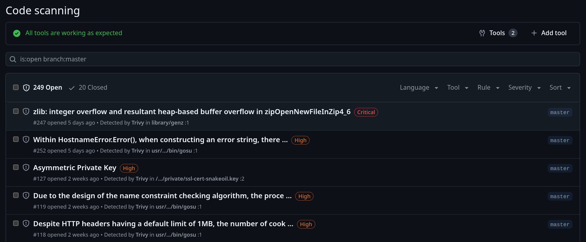
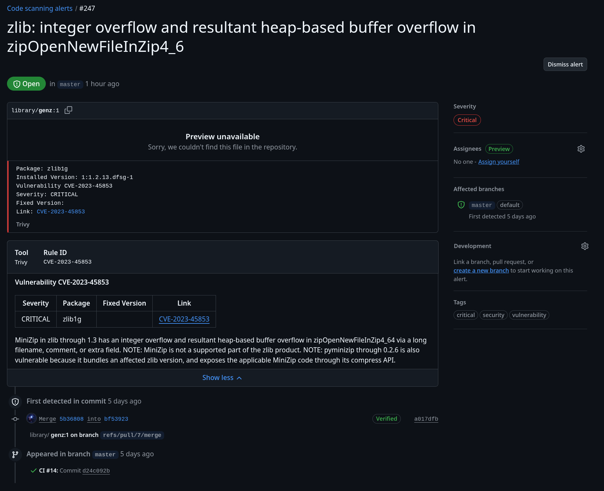
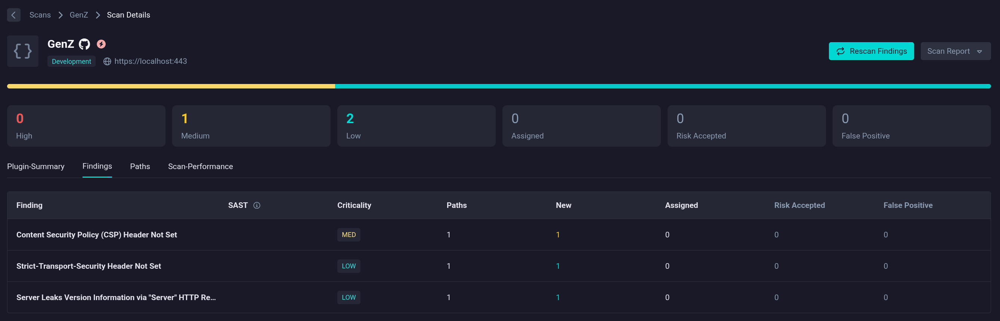
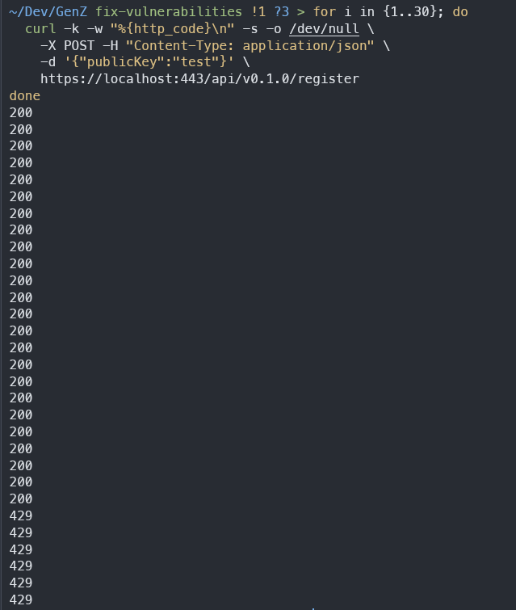

## Описание проекта

Сервис эмулирует работу сервисов по обработке ДНК, таких как 23andMe, но нацелен на полную конфиденциальность.
Алгоритмы реализованы с использованием гомоморфного шифрования, что позволяет сервисы осуществлять анализ на зашифрованных данных.

## Функциональные требования

### Анализ данных ДНК

Так как реальные алгоритмы, которые могут дать значимую информацию о ДНК, слишком сложны для реализации в рамках курса, в проекте будут реализованы упрощенные аналоги.

1. Подсчет количества различных видов нуклеотидов
2. Поиск заданной последовательности нуклеотидов

Формат незашифрованных данных: простой текст с цепочкой из символов C, G, A, T

В ходе передачи и обработки данных, данные находятся в зашифрованном виде, расшифровка происходит только на клиенте.

### Предоставление доступа к результатам по ссылке (не реализовано)

Пользователь должен иметь возможность сгенерировать ссылку на результаты анализа, по которой получатель сможет получить доступ к данным.

При генерации ссылки должна быть возможность настроить следующие атрибуты:

- Срок доступности данных по ссылке
- К каким данным предоставляется доступ (количество нуклеотидов, найденные последовательности, сырые данные ДНК)

При генерации ссылки требуется указать открытый ключ получателя, полученный им в клиенте сервиса.
Таким образом, сервис выступает лишь временным хранилищем зашифрованных данных и не имеет к ним доступ в незашифрованном виде.

## Модель угроз

**Система состоит из следующих компонентов:**

- Сервер на zig, предоставляющий API и реализующий алгоритм обработки ДНК
- Сервер Nginx поддержки HTTPS и раздачи статического контента (веб-приложения)
- Веб-клиент
- База данных Postgres

**Акторы:**

- `GenZ`: сервис, предоставляющий услуги приватного анализа ДНК при помощи проприетарных алгоритмов
- `Пользователь`: человек, желающий получить результаты анализа ДНК

**Требования к безопасности:**

`Пользователь` не доверяет `GenZ` данные своего ДНК, а также результаты анализа.
`GenZ` не должен иметь доступа к открытым данным ДНК или результату, а также не должен иметь возможность получить какую-либо вторичную информацию о данных (частотный анализ, сравнение с другими данными и тд).
То есть данные ДНК и результаты анализа должны соответствовать модели IND-SPA.
Из этого также следует, что в случае атаки на `GenZ` злоумышленник не будет иметь доступа к пользовательским данным в открытом виде.
На пользовательские данные, зашифрованные методами гомоморфного шифрования, дополнительные требования к безопасности не накладываются - они могу передаваться сервису `GenZ` и храниться в базе данных.

> IND-SPA (Неразличимость шифротекста) — это свойство многих систем шифрования. Интуитивно понятно, что если система обладает свойством неразличимости, то злоумышленник не сможет отличить пары шифротекстов, основываясь на открытых текстах, которые они шифруют.

Помимо этого к сервису предъявляются стандартные требования безопасности веб-приложений [OWASP Top 10 2025](https://owasp.org/www-project-top-ten/).

## Архитектура

### Диаграммы потоков данных

> [Architecture, Infrastructure, and Operations - Data Flow Diagrams](https://ithandbook.ffiec.gov/it-booklets/architecture-infrastructure-and-operations/iii-common-aio-risk-management-topics/iiic-it-and-business-environment-representations/iiic2-data-flow-diagrams/)

**Условные обозначения:**

- **Синий прямоугольник** - внешние сущности (пользователь, администратор, внешние системы)
- **Желтый круг** - процессы обработки данных
- **Красный цилиндр** - хранилища данных (PostgreSQL)
- **Зеленый параллелограмм** - файловые хранилища (статические файлы, конфигурация на файловой системе)
- **Сплошная стрелка** - активная передача данных между компонентами
- **Пунктирная стрелка** - операции чтения или пассивные потоки данных

---

#### Процесс 1.0: Генерация пары ключей на клиенте

**Описание:** Браузер запрашивает WASM библиотеку OpenFHE через HTTP. Nginx (процесс 1.0) читает файлы из хранилища DS2 и отправляет их клиенту. WASM модуль загружается и выполняется **в браузере** для генерации пары ключей BGV.

**Потенциальные угрозы:**

- MITM атака при передаче WASM и подмена кода

---

#### Процесс 2.0-4.0: Регистрация публичного ключа

**Описание:** Браузер отправляет публичный ключ в base64. Backend валидирует формат, декодирует в бинарные данные и сохраняет в PostgreSQL с UUID сессии. База данных подтверждает успешную запись. Процесс генерирует UUID и возвращает его пользователю.

**Потенциальные угрозы:**

- SQL injection при INSERT запросе
- Отсутствие аутентификации
- DoS через массовую регистрацию

---

#### Процесс 5.0: Раздача статических файлов

**Описание:** Браузер делает HTTPS запрос. Nginx (процесс 5.0) использует SSL сертификаты из DS3 для TLS handshake, читает запрошенные файлы из DS2 и отправляет зашифрованный ответ пользователю.

**Потенциальные угрозы:**

- SSL-stripping и downgrade атаки

## Нормативная база

Основными нормативными актами в области персональных и медицинских данных в РФ являются:

- [Федеральный закон от 27_07_2006 N 152-ФЗ "О персональных данных"](./docs/regulatory/Федеральный_закон_от_27_07_2006_N_152-ФЗ.pdf)
- [Федеральный закон от 21.11.2011 N 323-ФЗ "Об основах охраны здоровья граждан в Российской Федерации"](./docs/regulatory/Федеральный_закон_от_21.11.2011_N_323-ФЗ.pdf)

### Основные требования

**Статья 10 ФЗ-152 Специальные категории персональных данных**

1. Обработка специальных категорий персональных данных, касающихся расовой, национальной
   принадлежности, политических взглядов, религиозных или философских убеждений, состояния здоровья,
   интимной жизни, не допускается, за исключением случаев, предусмотренных частями 2 и 2.1 настоящей
   статьи.

2. Обработка указанных в части 1 настоящей статьи специальных категорий персональных данных
   допускается в случаях, если:

1) субъект персональных данных дал согласие в письменной форме на обработку своих
   персональных данных;

4. обработка персональных данных осуществляется в медико-профилактических целях, в целях
   установления медицинского диагноза, оказания медицинских и медико-социальных услуг при условии, что
   обработка персональных данных осуществляется лицом, профессионально занимающимся медицинской
   деятельностью и обязанным в соответствии с законодательством Российской Федерации сохранять
   врачебную тайну;

**Статья 14 ФЗ-152 Право субъекта персональных данных на доступ к его персональным данным**

1. Субъект персональных данных имеет право на получение сведений, указанных в части 7
   настоящей статьи, за исключением случаев, предусмотренных частью 8 настоящей статьи. Субъект
   персональных данных вправе требовать от оператора уточнения его персональных данных, их
   блокирования или уничтожения в случае, если персональные данные являются неполными, устаревшими,
   неточными, незаконно полученными или не являются необходимыми для заявленной цели обработки, а
   также принимать предусмотренные законом меры по защите своих прав.

**Статья 18 ФЗ-152. Обязанности оператора при сборе персональных данных**

5. При сборе персональных данных, в том числе посредством информационно-телекоммуникационной сети "Интернет", оператор обязан обеспечить запись, систематизацию, накопление, хранение, уточнение (обновление, изменение), извлечение персональных данных граждан Российской Федерации с использованием баз данных, находящихся на территории Российской Федерации, за исключением случаев, указанных в пунктах 2, 3, 4, 8 части 1 статьи 6 настоящего Федерального закона

**Статья 19 ФЗ-152 Меры по обеспечению безопасности персональных данных при их обработке**

1. Оператор при обработке персональных данных обязан принимать необходимые правовые,
   организационные и технические меры или обеспечивать их принятие для защиты персональных данных от
   неправомерного или случайного доступа к ним, уничтожения, изменения, блокирования, копирования,
   предоставления, распространения персональных данных, а также от иных неправомерных действий в
   отношении персональных данных.

**Статья 20 ФЗ-323**

1. Необходимым предварительным условием медицинского вмешательства является дача
   информированного добровольного согласия гражданина или его законного представителя на
   медицинское вмешательство на основании предоставленной медицинским работником в
   доступной форме полной информации о целях, методах оказания медицинской помощи,
   связанном с ними риске, возможных вариантах медицинского вмешательства, о его
   последствиях, а также о предполагаемых результатах оказания медицинской помощи.

**Статья 13. ФЗ-323 Соблюдение врачебной тайны**

1. Сведения о факте обращения гражданина за оказанием медицинской помощи, состоянии
   его здоровья и диагнозе, иные сведения, полученные при его медицинском обследовании и
   лечении, составляют врачебную тайну.

### Специфика проекта при обеспечении нормативных требований

1. Использование шифрование в транспорте и обработке исключает возможность просмотра персональных данных как третьими лицами, так и самим предоставителем услуг, что упрощает процесс контроля доступа к данным
2. Технология гомоморфного шифрования не регламентирована ФСТЭК или ФСБ, что усложнить прохождение сертификации
3. Предоставление письменного согласия противоречит идеи полной конфиденциальности, так как она связывает пользователя с фактом использования системы

## Гомоморфное шифрование

Собранные материалы можно найти в директории [docs](./docs/he)

Для реализации выбрана схема гомоморфного шифрования без бутстрапинга [BGV](<./docs/he/Fully_Homomorphic_Encryption_without_Bootstrapping_(BGV).pdf>), так как она позволяет производить произвольное количество операций над данными и понятна для реализации.

### OpenFHE

В качестве библиотеки гомоморфного шифрования выбрана библиотека [OpenFHE](https://openfhe-development.readthedocs.io/en/latest/index.html).

Библиотека активно поддерживается. Реализованные алгоритмы шифрования соответствуют IND-CPA, в том числе оригинальные алгоритмы модифицированы для устранения уязвимостей.

## Предотвращение угроз

Для предотвращение угроз предусмотрено использование многоуровневая защита

## Разработка

### Локально

Для предотвращения случайного попадания в GitHub ключей и других конфиденциальных данных настроены pre-commit хуки с `GitLeaks`.

### CI/CD

В CI/CD запускаются различные инструменты SAST и DAST для анализа исходных кодов, конфигурационных файлов и инфраструктуры.

- Checkov, Hadolint, Trivy Config: проверяют Dockerfile и docker-compose.yml на наличие уязвимостей и соответствие лучшим практикам.
  - Выявили незафиксированные версии образов и зависимостей. Фиксирование версий полезно для аудита зависимостей и предотвращения неожиданных обновлений
  - Выявили запуск приложения в Docker от root пользователя
  - Выявили отсутствие healthcheck, полезного для мониторинга
  - Выявили уязвимости в зависимостях, например, образе Postgres
- StackHawk: проверяет запущенное приложение на наличие уязвимостей
  - Выявил отсутствие CSP-заголовков в некоторых ресурсах
- GitLeaks: выявляет конфиденциальные данные (ключи, сертификаты) в истории git

**Проверки CI/CD:**

**Результаты сканирования Trivy и Checkov:**

Исходные коды,

**Пример уязвимости в пакете zlib, найденной Trivy:**

> False-positive: библиотека MiniZip официально удалена из Debian

**Результаты сканирования StackHawk:**

StackHawk - это инструмент DAST, он проверяет запущенное приложение - API, веб-интерфейс - на наличие уязвимостей.

Благодаря нему было выявлено отсутствие CSP-заголовков для некоторых путей Nginx.

## Валидация данных на сервере

Для обеспечения устойчивости бэкенда к атакам и программным сбоям реализован строгий контроль входящих данных и управления ресурсами.

- **Ограничение размера base64:** На уровне обработки API запросов установлены лимиты на длину декодируемых строк.
  - Предотвращает атаки типа "Отказ в обслуживании" (DoS) через отправку чрезмерно больших пейлоадов.
  - Снижает нагрузку на оперативную память при обработке изображений или файлов.
- **Защита памяти (Zig):** Бэкенд реализован на языке Zig, который предоставляет инструменты для безопасной работы с памятью.
  - Механизмы языка (spatial memory safety) предотвращают выход за границы буфера и другие критические ошибки, характерные для низкоуровневой разработки.

## Пользовательские данные

Для защиты наиболее чувствительной информации применяется современная криптография, исключающая доступ к данным в открытом виде.

- **FHE (Fully Homomorphic Encryption):** Полностью гомоморфное шифрование позволяет выполнять операции над данными без их расшифровки.
  - Обеспечивает конфиденциальность данных даже от администраторов сервера.
  - В случае компрометации инфраструктуры или базы данных злоумышленники получат только шифротекст, который невозможно использовать.

## Безопасность контейнеров

В Docker-контейнерах реализованы практики усиления безопасности (hardening).

- **Непривилегированный пользователь:** Приложение запускается от пользователя `appuser` (UID 1000), а не `root`, что ограничивает ущерб в случае компрометации контейнера.
- **Read-Only Mounts:** Конфигурационные файлы, сертификаты и статический контент монтируются в режиме "только для чтения" (:ro), предотвращая их подмену злоумышленником.

## Веб-сервер

В качестве обратного прокси-сервера используется Nginx, настроенный согласно рекомендациям по безопасности для защиты периметра.

- **TLS:** Настроен защищенный протокол передачи данных с актуальными наборами шифров (cipher suites) и поддержкой Forward Secrecy (ECDHE).
  - Обеспечивает целостность и конфиденциальность трафика. Forward Secrecy гарантирует, что даже при компрометации приватного ключа сервера в будущем, перехваченный ранее трафик невозможно будет расшифровать.
- **Ограничение на размер файла:** В конфигурации Nginx (`client_max_body_size`) задан жесткий лимит на размер тела запроса.
  - Предотвращает переполнение дискового пространства и каналов связи нелегитимными загрузками.
- **Ограничение скорости запросов:** В конфигурации Nginx задано ограничение на скорость запросов.
  - Предотвращает атаку DDOS

**Предотвращение DDOS:**

## Веб-приложение

Безопасность на стороне клиента (браузера) обеспечивается передачей специальных HTTP-заголовков ответа, минимизирующих векторы атак.

- **HTTP Strict Transport Security (HSTS):** Заголовок `Strict-Transport-Security` настроен с `max-age=31536000` (1 год) и `includeSubDomains`.
  - Принудительно переводит браузер на HTTPS для всех последующих запросов к домену.
  - Предотвращает SSL-stripping атаки и downgrade-атаки, когда злоумышленник пытается перенаправить пользователя на незащищенный HTTP-канал.
  - Директива `includeSubDomains` распространяет защиту на все поддомены.
- **Content-Security-Policy (CSP):** Определяет список доверенных источников для загрузки скриптов, стилей и изображений.
  - Эффективно блокирует XSS-атаки и инъекции вредоносного кода.
- **X-Content-Type-Options:** Установлен в значение `nosniff`.
  - Запрещает браузерам "угадывать" MIME-тип содержимого, отличный от объявленного сервером, предотвращая выполнение файлов с подмененным расширением.
- **X-XSS-Protection:** Активирует встроенный в старые браузеры фильтр межсайтового скриптинга как дополнительный уровень защиты.
- **X-Frame-Options:** Установлен в значение `DENY`.
  - Запрещает отображение сайта в `<iframe>`, защищая от Clickjacking-атак.
