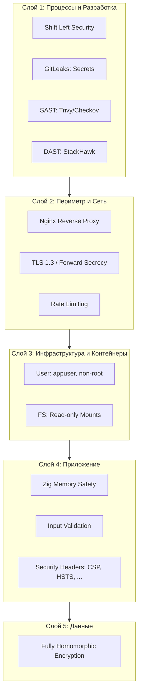

## Описание проекта

Сервис эмулирует работу сервисов по обработке ДНК, таких как 23andMe, но нацелен на полную конфиденциальность.
Алгоритмы реализованы с использованием гомоморфного шифрования, что позволяет сервисы осуществлять анализ на зашифрованных данных.

## Функциональные требования

### Анализ данных ДНК

Так как реальные алгоритмы, которые могут дать значимую информацию о ДНК, слишком сложны для реализации в рамках курса, в проекте будут реализованы упрощенные аналоги.

1. Подсчет количества различных видов нуклеотидов
2. Поиск заданной последовательности нуклеотидов

Формат незашифрованных данных: простой текст с цепочкой из символов C, G, A, T

В ходе передачи и обработки данных, данные находятся в зашифрованном виде, расшифровка происходит только на клиенте.

### Предоставление доступа к результатам по ссылке (не реализовано)

Пользователь должен иметь возможность сгенерировать ссылку на результаты анализа, по которой получатель сможет получить доступ к данным.

При генерации ссылки должна быть возможность настроить следующие атрибуты:

- Срок доступности данных по ссылке
- К каким данным предоставляется доступ (количество нуклеотидов, найденные последовательности, сырые данные ДНК)

При генерации ссылки требуется указать открытый ключ получателя, полученный им в клиенте сервиса.
Таким образом, сервис выступает лишь временным хранилищем зашифрованных данных и не имеет к ним доступ в незашифрованном виде.

## Модель угроз

**Система состоит из следующих компонентов:**

- Сервер на zig, предоставляющий API и реализующий алгоритм обработки ДНК
- Сервер Nginx поддержки HTTPS и раздачи статического контента (веб-приложения)
- Веб-клиент
- База данных Postgres

**Акторы:**

- `GenZ`: сервис, предоставляющий услуги приватного анализа ДНК при помощи проприетарных алгоритмов
- `Пользователь`: человек, желающий получить результаты анализа ДНК

**Атакующие:**

- **Внешний злоумышленник**: не имеет доступа к инфраструктуре, атакует через сеть
- **Любопытный администратор GenZ**: имеет доступ к серверам и БД, но не должен видеть данные пользователей
- **Скомпрометированный пользователь**: украден приватный ключ или sessionId
- **MITM атакующий**: провайдер, корпоративный proxy, государственные структуры
- **Malicious insider**: разработчик GenZ с доступом к исходному коду и инфраструктуре

**Требования к безопасности:**

`Пользователь` не доверяет `GenZ` данные своего ДНК, а также результаты анализа.
`GenZ` не должен иметь доступа к открытым данным ДНК или результату, а также не должен иметь возможность получить какую-либо вторичную информацию о данных (частотный анализ, сравнение с другими данными и тд).
То есть данные ДНК и результаты анализа должны соответствовать модели IND-SPA.
Из этого также следует, что в случае атаки на `GenZ` злоумышленник не будет иметь доступа к пользовательским данным в открытом виде.
На пользовательские данные, зашифрованные методами гомоморфного шифрования, дополнительные требования к безопасности не накладываются - они могу передаваться сервису `GenZ` и храниться в базе данных.

> IND-SPA (Неразличимость шифротекста) — это свойство многих систем шифрования. Интуитивно понятно, что если система обладает свойством неразличимости, то злоумышленник не сможет отличить пары шифротекстов, основываясь на открытых текстах, которые они шифруют.

Помимо этого к сервису предъявляются стандартные требования безопасности веб-приложений [OWASP Top 10 2025](https://owasp.org/www-project-top-ten/).

## Архитектура

### Диаграммы потоков данных

> [Architecture, Infrastructure, and Operations - Data Flow Diagrams](https://ithandbook.ffiec.gov/it-booklets/architecture-infrastructure-and-operations/iii-common-aio-risk-management-topics/iiic-it-and-business-environment-representations/iiic2-data-flow-diagrams/)

**Условные обозначения:**

- **Синий прямоугольник** - внешние сущности (пользователь, администратор, внешние системы)
- **Желтый круг** - процессы обработки данных
- **Красный цилиндр** - хранилища данных (PostgreSQL)
- **Зеленый параллелограмм** - файловые хранилища (статические файлы, конфигурация на файловой системе)
- **Сплошная стрелка** - активная передача данных между компонентами
- **Пунктирная стрелка** - операции чтения или пассивные потоки данных

---

#### Процесс 1.0: Генерация пары ключей на клиенте

**Описание:** Браузер запрашивает WASM библиотеку OpenFHE через HTTP. Nginx (процесс 1.0) читает файлы из хранилища DS2 и отправляет их клиенту. WASM модуль загружается и выполняется **в браузере** для генерации пары ключей BGV.

**STRIDE анализ:**

| STRIDE              | Угроза                                | Реализовано                      | Остаточный риск |
| ------------------- | ------------------------------------- | -------------------------------- | --------------- |
| **Tampering **      | Подмена WASM → бэкдор в ключах        | TLS 1.2+ с валидным сертификатом | Низкий          |
| **Tampering **      | Модификация WASM расширением браузера | Нет                              | **ВЫСОКИЙ**     |
| **Tampering **      | Изменение файлов на диске             | Read-only mount                  | Низкий          |
| **Tampering **      | SSL-stripping                         | HSTS (max-age=31536000)          | Низкий          |
| **Repudiation **    | Нет логов скачивания                  | Нет                              | **КРИТИЧЕСКИЙ** |
| **Info Disclosure** | Слабый RNG при генерации ключей       | crypto.getRandomValues()         | Средний         |
| **Info Disclosure** | Ключ в memory → XSS кража             | CSP + X-Frame-Options            | Низкий          |
| **DoS **            | GET flood на статику                  | Нет rate limit для /static/      | Средний         |

---

#### Процесс 2.0-4.0: Регистрация публичного ключа

**Описание:** Браузер отправляет публичный ключ в base64. Backend валидирует формат, декодирует в бинарные данные и сохраняет в PostgreSQL с UUID сессии. База данных подтверждает успешную запись. Процесс генерирует UUID и возвращает его пользователю.

**STRIDE анализ:**

| STRIDE               | Угроза                                 | Реализовано                        | Остаточный риск |
| -------------------- | -------------------------------------- | ---------------------------------- | --------------- |
| **Tampering **       | SQL injection                          | Параметризация (pg library)        | Минимальный     |
| **Tampering **       | Модификация publicKey в transit        | TLS 1.2+ с валидным сертификатом   | Низкий          |
| **Repudiation **     | Невозможно доказать, кто регистрировал | Нет аудит-логов и авторизации      | **КРИТИЧЕСКИЙ** |
| **Info Disclosure ** | Timing attack по размеру ключа         | Нет                                | Низкий          |
| **DoS **             | Массовая регистрация (1M записей)      | Rate limiting 10r/s, burst=20      | Средний         |
| **DoS **             | Огромный publicKey                     | Лимит 10MB (nginx + httpz)         | Низкий          |
| **DoS **             | Заполнение БД                          | Нет квот на пользователя           | Средний         |
| **Elevation **       | Доступ к чужим данным                  | FHE (только владелец ключа читает) | Низкий          |

---

#### Процесс 5.0: Раздача статических файлов

**Описание:** Браузер делает HTTPS запрос. Nginx (процесс 5.0) использует SSL сертификаты из DS3 для TLS handshake, читает запрошенные файлы из DS2 и отправляет зашифрованный ответ пользователю.

**STRIDE анализ:**

| STRIDE         | Угроза                               | Реализовано                  | Остаточный риск |
| -------------- | ------------------------------------ | ---------------------------- | --------------- |
| **Tampering ** | SSL-stripping                        | HSTS (max-age=31536000)      | Низкий          |
| **Tampering ** | Downgrade attack                     | TLS 1.2+ (ciphers: ECDHE)    | Низкий          |
| **DoS **       | Request flooding на /static/         | Нет rate limit для статики   | Средний         |
| **Elevation ** | Path traversal (../../../etc/passwd) | Nginx защита + read-only :ro | Низкий          |

---

### STRIDE анализ хранилищ данных

**D1: PostgreSQL (keys table)**

| STRIDE              | Угроза                       | Реализовано                                   | Остаточный риск |
| ------------------- | ---------------------------- | --------------------------------------------- | --------------- |
| **Tampering **      | Прямое изменение данных в БД | Non-root user, Docker network isolation       | Средний         |
| **Repudiation **    | Изменение без аудита         | WAL логи включены (по умолчанию в PostgreSQL) | **ВЫСОКИЙ**     |
| **Info Disclosure** | Дамп БД через SQL injection  | Параметризация (pg library)                   | Минимальный     |
| **Info Disclosure** | Утечка через бэкапы          | Данные: публичные ключи FHE (не секретны)     | Низкий          |
| **DoS **            | Заполнение диска             | Нет квот на volume                            | Средний         |
| **Elevation **      | Доступ из backend контейнера | Password auth + изолированная Docker сеть     | Низкий          |

**D2: Статические файлы**

| STRIDE         | Угроза                | Реализовано      | Остаточный риск |
| -------------- | --------------------- | ---------------- | --------------- |
| **Tampering ** | Замена WASM/JS файлов | Read-only mount  | Низкий          |
| **DoS **       | Symlink bomb          | Docker isolation | Низкий          |

**D3: SSL сертификаты**

| STRIDE               | Угроза            | Реализовано             | Остаточный риск |
| -------------------- | ----------------- | ----------------------- | --------------- |
| **Tampering **       | Замена cert/key   | Read-only mount (:ro)   | Низкий          |
| **Info Disclosure ** | Кража private key | Non-root, read-only :ro | Низкий          |

---

### FHE-специфичные угрозы

| Угроза               | Описание                                          | Риск                                                     |
| -------------------- | ------------------------------------------------- | -------------------------------------------------------- |
| Side-channel         | Timing/power analysis на операциях FHE            | Низкий (клиентская генерация)                            |
| Malleable ciphertext | Модификация шифротекста → предсказуемый plaintext | Низкий (BGV параметры: depth=2, modulus=65537)           |
| Noise exhaustion     | Слишком много операций → некорректная расшифровка | Низкий (depth=2 достаточен)                              |
| Недостаток энтропии  | crypto.getRandomValues() в браузере               | Низкий (стандарт Web Crypto API)                         |
| Потеря ключа         | Нет recovery → потеря данных навсегда             | **Пользовательская ответственность** (не дефект системы) |

---

### Топ-7 критических рисков

| №   | Угроза                                    | Вероятность | Влияние     | Риск            | Меры                            | Остаточный риск                  |
| --- | ----------------------------------------- | ----------- | ----------- | --------------- | ------------------------------- | -------------------------------- |
| 1   | Отсутствие аудит-логов регистрации ключей | Высокая     | Критическое | **КРИТИЧЕСКИЙ** | Нет аудит-логов                 | **КРИТИЧЕСКИЙ**                  |
| 2   | Отсутствие логов скачивания WASM          | Высокая     | Критическое | **КРИТИЧЕСКИЙ** | Нет логов                       | **КРИТИЧЕСКИЙ**                  |
| 3   | Browser extension → модификация WASM      | Средняя     | Критическое | **ВЫСОКИЙ**     | CSP (не защищает от extensions) | **ВЫСОКИЙ**                      |
| 4   | Изменение БД без полноценного аудита      | Средняя     | Критическое | **ВЫСОКИЙ**     | Только WAL логи PostgreSQL      | **ВЫСОКИЙ**                      |
| 5   | Потеря приватного ключа → потеря данных   | Высокая     | Критическое | **ВЫСОКИЙ**     | Предупреждение пользователю     | **Ответственность пользователя** |
| 6   | DoS через массовую регистрацию            | Средняя     | Среднее     | **СРЕДНИЙ**     | Rate limit 10r/s burst=20       | **СРЕДНИЙ**                      |
| 7   | Заполнение диска БД                       | Средняя     | Среднее     | **СРЕДНИЙ**     | Нет квот на storage             | **СРЕДНИЙ**                      |

---

## Нормативная база

Основными нормативными актами в области персональных и медицинских данных в РФ являются:

- [Федеральный закон от 27_07_2006 N 152-ФЗ "О персональных данных"](./docs/regulatory/Федеральный_закон_от_27_07_2006_N_152-ФЗ.pdf)
- [Федеральный закон от 21.11.2011 N 323-ФЗ "Об основах охраны здоровья граждан в Российской Федерации"](./docs/regulatory/Федеральный_закон_от_21.11.2011_N_323-ФЗ.pdf)

### Основные требования

**Статья 10 ФЗ-152 Специальные категории персональных данных**

1. Обработка специальных категорий персональных данных, касающихся расовой, национальной
   принадлежности, политических взглядов, религиозных или философских убеждений, состояния здоровья,
   интимной жизни, не допускается, за исключением случаев, предусмотренных частями 2 и 2.1 настоящей
   статьи.

2. Обработка указанных в части 1 настоящей статьи специальных категорий персональных данных
   допускается в случаях, если:

1) субъект персональных данных дал согласие в письменной форме на обработку своих
   персональных данных;

4. обработка персональных данных осуществляется в медико-профилактических целях, в целях
   установления медицинского диагноза, оказания медицинских и медико-социальных услуг при условии, что
   обработка персональных данных осуществляется лицом, профессионально занимающимся медицинской
   деятельностью и обязанным в соответствии с законодательством Российской Федерации сохранять
   врачебную тайну;

**Статья 14 ФЗ-152 Право субъекта персональных данных на доступ к его персональным данным**

1. Субъект персональных данных имеет право на получение сведений, указанных в части 7
   настоящей статьи, за исключением случаев, предусмотренных частью 8 настоящей статьи. Субъект
   персональных данных вправе требовать от оператора уточнения его персональных данных, их
   блокирования или уничтожения в случае, если персональные данные являются неполными, устаревшими,
   неточными, незаконно полученными или не являются необходимыми для заявленной цели обработки, а
   также принимать предусмотренные законом меры по защите своих прав.

**Статья 18 ФЗ-152. Обязанности оператора при сборе персональных данных**

5. При сборе персональных данных, в том числе посредством информационно-телекоммуникационной сети "Интернет", оператор обязан обеспечить запись, систематизацию, накопление, хранение, уточнение (обновление, изменение), извлечение персональных данных граждан Российской Федерации с использованием баз данных, находящихся на территории Российской Федерации, за исключением случаев, указанных в пунктах 2, 3, 4, 8 части 1 статьи 6 настоящего Федерального закона

**Статья 19 ФЗ-152 Меры по обеспечению безопасности персональных данных при их обработке**

1. Оператор при обработке персональных данных обязан принимать необходимые правовые,
   организационные и технические меры или обеспечивать их принятие для защиты персональных данных от
   неправомерного или случайного доступа к ним, уничтожения, изменения, блокирования, копирования,
   предоставления, распространения персональных данных, а также от иных неправомерных действий в
   отношении персональных данных.

**Статья 20 ФЗ-323**

1. Необходимым предварительным условием медицинского вмешательства является дача
   информированного добровольного согласия гражданина или его законного представителя на
   медицинское вмешательство на основании предоставленной медицинским работником в
   доступной форме полной информации о целях, методах оказания медицинской помощи,
   связанном с ними риске, возможных вариантах медицинского вмешательства, о его
   последствиях, а также о предполагаемых результатах оказания медицинской помощи.

**Статья 13. ФЗ-323 Соблюдение врачебной тайны**

1. Сведения о факте обращения гражданина за оказанием медицинской помощи, состоянии
   его здоровья и диагнозе, иные сведения, полученные при его медицинском обследовании и
   лечении, составляют врачебную тайну.

### Специфика проекта при обеспечении нормативных требований

1. Использование шифрование в транспорте и обработке исключает возможность просмотра персональных данных как третьими лицами, так и самим предоставителем услуг, что упрощает процесс контроля доступа к данным
2. Технология гомоморфного шифрования не регламентирована ФСТЭК или ФСБ, что усложнить прохождение сертификации
3. Предоставление письменного согласия противоречит идеи полной конфиденциальности, так как она связывает пользователя с фактом использования системы

## Гомоморфное шифрование

Собранные материалы можно найти в директории [docs](./docs/he)

Для реализации выбрана схема гомоморфного шифрования без бутстрапинга [BGV](<./docs/he/Fully_Homomorphic_Encryption_without_Bootstrapping_(BGV).pdf>), так как она позволяет производить произвольное количество операций над данными и понятна для реализации.

### OpenFHE

В качестве библиотеки гомоморфного шифрования выбрана библиотека [OpenFHE](https://openfhe-development.readthedocs.io/en/latest/index.html).

Библиотека активно поддерживается. Реализованные алгоритмы шифрования соответствуют IND-CPA, в том числе оригинальные алгоритмы модифицированы для устранения уязвимостей.

## Стратегия эшелонированной защиты (Defense in Depth)

Для обеспечения безопасности системы применяется подход Defense in Depth, разделяющий меры защиты на изолированные слои. Компрометация одного уровня не гарантирует доступ к критическим активам.

### Слой 1: Процессы и Безопасная Разработка (DevSecOps)

_Цель: Устранение уязвимостей до развертывания кода (Shift Left)._

#### Локальная защита

На этапе написания кода предотвращается утечка секретов.

- **Pre-commit hooks:** Автоматический запуск проверок перед коммитом.
- **GitLeaks:** Сканирование истории git на наличие ключей, сертификатов и паролей.

#### CI/CD Пайплайн

Автоматизированный анализ инфраструктуры и артефактов на наличие уязвимостей (CVE) и мисконфигураций.

| Инструмент           | Область проверки      | Ключевые находки / Меры                                                                        |
| -------------------- | --------------------- | ---------------------------------------------------------------------------------------------- |
| **Trivy / Hadolint** | Dockerfile, Образы    | Выявлены и исправлены: запуск от root, отсутствие healthcheck, незафиксированные версии тегов. |
| **Checkov**          | IaC (Docker Compose)  | Аудит конфигурации инфраструктуры.                                                             |
| **StackHawk (DAST)** | Запущенное приложение | Динамический анализ API. Выявил отсутствие CSP-заголовков на ряде эндпоинтов.                  |

**Примеры отчетов сканирования:**

_Результаты анализа кода (Trivy/Checkov):_

_Пример обнаружения CVE (с примечанием о False-positive в zlib):_

_Результаты динамического анализа (StackHawk):_

### Слой 2: Периметр и Сеть

_Цель: Фильтрация трафика и защита точки входа._

В качестве шлюза выступает обратный прокси-сервер **Nginx**, настроенный для отражения сетевых атак.

- **Шифрование (TLS):** Используются современные наборы шифров (Cipher Suites) с поддержкой Forward Secrecy (ECDHE). Даже при краже ключа сервера прошлый трафик невозможно расшифровать.
- **Защита от DDoS (Rate Limiting):** Ограничение скорости запросов для предотвращения перегрузки сервиса.
- **Блокировка аномалий:** Жесткий лимит `client_max_body_size` предотвращает переполнение диска через загрузку огромных файлов.

_Демонстрация предотвращения DDOS:_

### Слой 3: Инфраструктура и Контейнеры (Host)

_Цель: Ограничение ущерба при взломе приложения._

Если злоумышленник "пробил" защиту сети и приложения, он попадает в изолированную среду контейнера с минимальными правами (Hardening).

1.  **Non-root User:** Приложение работает от пользователя `appuser` (UID 1000). Это блокирует большинство атак, требующих привилегий суперпользователя.
2.  **Read-Only Filesystem:** Критические директории, конфиги и сертификаты монтируются в режиме `:ro`. Злоумышленник не может закрепиться в системе, изменив файлы конфигурации или загрузив бэкдор.

### Слой 4: Уровень Приложения (Application)

_Цель: Защита логики и клиентской части._

#### Защита Backend (Server-side)

- **Безопасность памяти (Zig):** Использование языка Zig с механизмами _spatial memory safety_ исключает классы уязвимостей, связанные с переполнением буфера.
- **Строгая валидация:**
  - Лимиты на декодирование Base64 (защита от DoS по памяти).
  - Проверка типов входящих данных.

#### Защита Frontend (Client-side headers)

Сервер отправляет инструкции браузеру для минимизации векторов атак на клиента (XSS, Clickjacking, MIM-sniffing).

- **HSTS:** `max-age=31536000`, `includeSubDomains`. Принудительный HTTPS, защита от SSL-stripping.
- **Content-Security-Policy (CSP):** Белый список источников контента. Блокирует выполнение вредоносных JS-скриптов.
- **X-Frame-Options:** `DENY`. Полная защита от кликджекинга (сайт нельзя открыть в iframe).
- **X-Content-Type-Options:** `nosniff`. Запрет на интерпретацию файлов неверного типа (например, исполнение картинки как скрипта).

### Слой 5: Данные (Data)

_Цель: Обеспечение конфиденциальности даже при полной компрометации инфраструктуры._

Это последний и самый надежный рубеж обороны.

- **FHE (Fully Homomorphic Encryption):**
  - Данные обрабатываются в зашифрованном виде.
  - Сервер **никогда** не видит данные в открытом виде (PlainText).
  - Даже если администратор сервера или злоумышленник с правами root получит доступ к памяти процесса или базе данных, он увидит лишь бесполезный шифротекст.

## Анализ соответствия OWASP Top 10 (2021)

| Категория                                     | Статус         | Реализованные меры защиты                                                                                                                                                   |
| --------------------------------------------- | -------------- | --------------------------------------------------------------------------------------------------------------------------------------------------------------------------- |
| **A01: Broken Access Control**                | Частично       | Отсутствует аутентификация пользователей. Контроль доступа к данным обеспечивается через криптографию (FHE) — доступ к данным возможен только при наличии приватного ключа. |
| **A02: Cryptographic Failures**               | Частично       | TLS 1.3 с Forward Secrecy (ECDHE), FHE (BGV) для данных, IND-CPA гарантии OpenFHE. Self-signed сертификаты .                                                                |
| **A03: Injection**                            | Защищено       | Параметризованные SQL-запросы (pg library), строгая валидация Base64-входных данных, лимиты на декодирование. Memory-safe язык (Zig) исключает buffer overflow.             |
| **A04: Insecure Design**                      | Защищено       | Defense in Depth архитектура с 5 слоями защиты. Data Flow Diagrams для анализа угроз. Shift Left Security (GitLeaks, SAST, DAST в CI/CD).                                   |
| **A05: Security Misconfiguration**            | Защищено       | IaC сканирование (Trivy, Checkov, Hadolint), non-root контейнеры, read-only FS, rate limiting, security headers (CSP, HSTS, X-Frame-Options, X-Content-Type-Options).       |
| **A06: Vulnerable Components**                | Защищено       | Trivy сканирует Docker-образы и зависимости на CVE. OpenFHE активно поддерживается. Pre-commit hooks + CI/CD пайплайн блокируют уязвимые зависимости.                       |
| **A07: Authentication Failures**              | Не реализовано | Отсутствует аутентификация и управление сессиями. Доступ к данным контролируется только криптографическими ключами (trust model: "ключ = личность").                        |
| **A08: Software and Data Integrity Failures** | Защищено       | CSP блокирует несанкционированные скрипты. GitLeaks + pre-commit hooks предотвращают инъекцию вредоносного кода. HTTPS защищает целостность при передаче.                   |
| **A09: Logging and Monitoring Failures**      | Частично       | StackHawk DAST мониторинг в CI/CD, GitHub Code Scanning. Отсутствует централизованное логирование событий безопасности и аномалий в runtime.                                |
| **A10: Server-Side Request Forgery**          | Не применимо   | Приложение не делает исходящих HTTP-запросов по пользовательскому вводу. Backend работает только с POST /register и базой данных.                                           |
